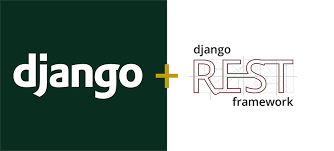

()

# API Rest para avaliação de restaurantes

## 📖  Descrição

Esse é o projeto de uma API Rest para simulação de uma transação usando cartão de credito ou debito.

<br/>

## 🛠️ Funcionalidades

- Armazenar os dados de cada transação feita
- O Usuario pode listar todas as transações
- Obter todas os fundos que se encontram disponiveis.
- Os fundos são definidos com base no calculo para credito ou debito
<br/>

## 📡 Tecnologias utilizadas 
<div align="center"> 


</div>
<br/><br/>

## ⏳ Inicialização

A preparação do ambiente consiste em instalar as tecnologias citadas anteriormente de acordo com seu sistema operacional.

Abra terminal do seu sistema e execue comando ````git clone (url do projeto)``

Para instalar o Django você pode usar comando ```pip install djangorestframework```

Instale as dependencias do projeto ```pip install -r requirements.txt```


<br/>

## 🔮 Implementações futuras
1. Implementar nova funcionalidade que consulta valor que pessoa tem de saldo no ato da transação

2. Negar transação quando saldo estiver abaixo do valor da compra.

3. Implementar autenticação e login para usuarios.


<br/>

## 🔎 Status do Projeto


<br/>

